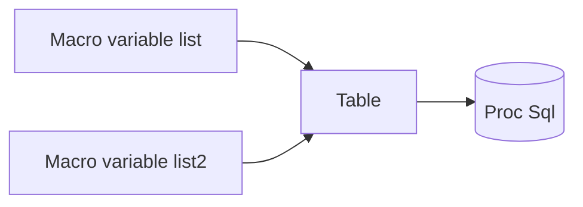

## 取两个SAS宏参的交集

### 前言

​         众所周知，SAS最擅长处理的数据结构就是表，但没有Python列表这种灵活简单的数据结构，进行取交集并集等操作，让他使用起来不太方便，于是我就经常将宏参当作列表来使用，英文可以表示为（ Macro variable list ），但中文怎么翻译怎么拗口，就是长成如下样子：

```SAS
%let sample=book window music water;
%put &sample;
```

既然SAS擅长处理表格，那么只要把这个宏参转化为一个表格，利用SAS优势进行处理就行了。

### 思路



之后就可以运用Sql的交集并集来进行下一步处理。

代码示例

```SAS
%let sample1=book window music water;
%put &sample1;
%let sample2=book window music base japan;
%put &sample2;

/* Turn Macro Variable List To Table */
data sample1;
	str="&sample1";

	do i=1 to countw(str, ' ');
		value=scan(str, i, " ");
		output;
	end;
	drop str i;
run;

data sample2;
	str="&sample2";

	do i=1 to countw(str, ' ');
		value=scan(str, i, " ");
		output;
	end;
	drop str i;
run;

/* Proc Sql to get want variables */
proc sql noprint;
	create table same as select a.* from sample1 a intersect selevt b.* from 
		sample2 b;
quit;
```

### 输出


就已经找到他们的交集了，如果需要继续使用，也只需要通过Proc Sql将他们转换为宏参就行。

很蠢这么简单的功能都要这么长的Code，但其实自己只要封装成自己的Macro，以后也能自己开箱就用，也不会很麻烦，在实际业务处理过程中，生产封装自己的Macro，其实还是很高效，难在前期。


